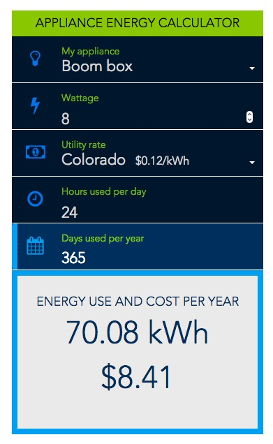

eere-appliance-calculon
=======================

Prototype for a simple appliance calculator.

Figure out how much energy your boom-box uses running it 24/7/365.  :speaker:

Try out the Demo
http://nrel.github.io/eere-appliance-calculon/




## Requirements

* Node.js (and you get npm with that)
* Git
* Grunt.js http://gruntjs.com/getting-started

Run ```npm install -g grunt-cli``` while logged into the devvpn to install Grunt on your computer.

## Development

Do your work in the src folder.

Type ```grunt``` at the command line from the root of your project to run the default task. This will build the application in the ```dist``` folder. (you could also run ```grunt build```)

The default task will run the subtasks: copy/eslint/babel/uglify/cssmin.

There is also a ```grunt watch``` task that watches the ```src/``` folder for changes and then runs the build task. You'll need a LiveReload plugin to whatever browser you use. (e.g. https://chrome.google.com/webstore/detail/livereload/jnihajbhpnppcggbcgedagnkighmdlei)

See ```grunt --help``` for more tasks.


## Deployment

This project can be deployed to two possible places. Use the ```grunt aws``` task to deploy to Amazon S3, or the ```grunt ghpages``` task to deploy to nrel.github.io. We are currently using nrel.github.io for our production site.

If using AWS, grunt will need your AWS credentials to push to an S3 bucket. By default it will look for a file called  /_config/s3.js at the project root. That file should look like:


```js
module.exports = {
    accessKeyId: 'your_key',
    secretAccessKey: 'your_secret_key'
}
```

This file is added to .gitignore so you won't push your credentials to the repo.

You can use this deployment if you want to push to the widgets.nrel.gov server.


## Background

This calculator uses state energy rate data from the EIA API at
http://www.eia.gov/opendata/
